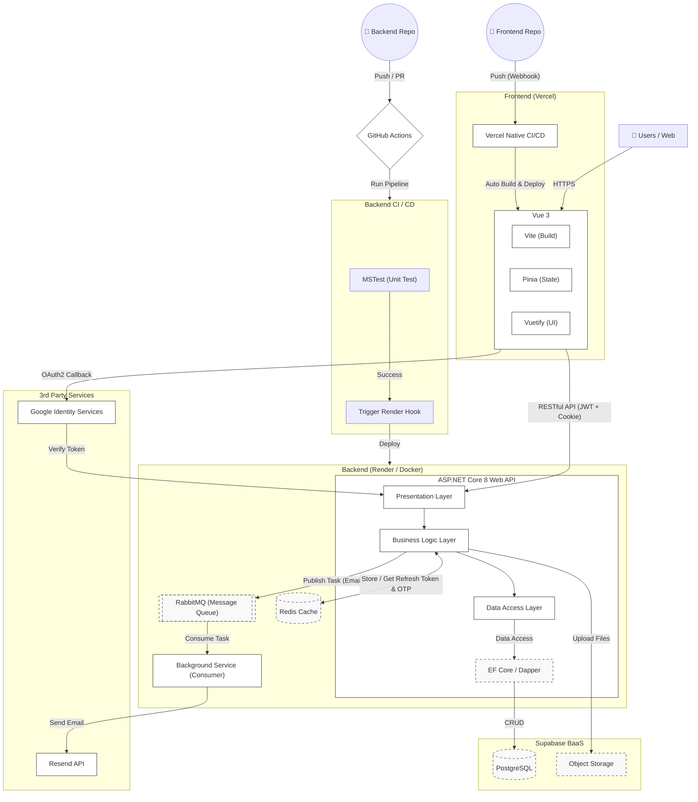

# Modern Full-Stack Auth Starter
基於現代化架構 (ASP.NET Core 8 + Vue 3) 的全端會員認證系統，整合 OAuth2 , 雙 Token 安全驗證機制，透過 Redis 控管憑證生命週期，並導入 RabbitMQ 處理非同步任務，且支援完整的容器化部署流程。
- 前端專案: [modern-auth-vue](https://github.com/JiaYingDai/modern-auth-vue)
- 後端專案: [modern-auth-api](https://github.com/JiaYingDai/modern-auth-api)

- Demo Website: [Modern Full-Stack Auth Starter](https://modern-auth-vue-git-develop-lisas-projects-7d037450.vercel.app)  
- ⚠️Demo Website 測試須知:
  - 登入方式建議: 開發階段受限於第三方信件服務限制，系統產生的「註冊驗證信」與「忘記密碼信」目前僅供開發者網域接收。一般訪客請直接使用「Google 第三方登入」即可快速體驗完整功能！
  - 系統啟動說明: 本站部署於 Render 環境，若長時間未執行會進入休眠狀態。初次連線需等待約 30-60 秒進行「冷啟動」，請稍後片刻。

- API 文件: [modern-auth-api API文件](https://docs.google.com/document/d/1fulGMic8bEc8mv0EP6BKKTb2-M9F0NC_hG1JUpx1vbM/edit?usp=sharing)

## 功能簡述
- 會員登入
  - 一般帳號密碼登入 
  - 第三方登入 (Google)
  - 忘記密碼 & 重設密碼
- 會員註冊
  - 註冊驗證信發送
- 首頁
- 會員頁面
- 登出


## 專案亮點 (Key Features)
### 身份驗證 & 資安
  - 高安全性登入機制: 實作 JWT (Access Token) 搭配 HttpOnly Cookie (Refresh Token) 的雙重驗證架構，解決 XSS , CSRF 攻擊風險並提升使用者體驗。
  - Google OAuth2 整合: 使用 GSI (Google Sign-In) 實現第三方登入模式。
  - 密碼安全: 使用 Argon2d 雜湊演算法 (目前業界公認最強抗攻擊能力) 取代傳統 SHA / bcrypt ，提升密碼抗暴力破解能力。
  - 一次性 Token (OTP): 應用於【忘記密碼】、【註冊信箱驗證】流程，確保連結僅能使用一次。

### 系統架構 & DevOps
  - 整潔式架構: 後端採用三層式架構 (展示層-業務邏輯層-資料存取層)，確保業務邏輯與資料存取解耦，易於測試與維護。
  - Redis Token 生命週期管理: 整合 Redis 處理 Refresh Token 與 一次性驗證 Token ，利用 TTL (Time-To-Live) 自動控管 Token 時效，降低資料庫負載、提升驗證效能。
  - 非同步任務處理 (RabbitMQ): 將寄送信件等高延遲任務移交給背景 Worker (Consumer) ，透過 Message Queue 非同步處理，大幅降低 API 回應時間並提升系統吞吐量。
  - 容器化與 CI/CD 自動化部署: 採用前後端分離架構，前端部署於 Vercel，後端容器化 (Docker) 部署至 Render。整合 GitHub Actions 建立自動化 CI / CD 流程，加速從代碼提交到生產部署。資料庫與儲存則託管於 Supabase。


## Tech Stack
<table>
  <thead>
    <tr>
      <th style="width: 15%">類別</th>
      <th style="width: 25%">技術</th>
      <th>應用場景與技術說明</th>
    </tr>
  </thead>
  <tbody>
    <tr>
      <td rowspan="4"><b>前端</b></td>
      <td><b>Vue 3</b></td>
      <td>採用 Composition API 與 <code>&lt;script setup&gt;</code> 語法，建構模組化 UI</td>
    </tr>
    <tr>
      <td><b>Vite</b></td>
      <td>新一代前端建構工具，提供開箱即用的專案骨架，具快速熱重載 (HMR) 及優異的打包效能，大幅提升開發體驗</td>
    </tr>
    <tr>
      <td><b>Pinia</b></td>
      <td>輕量級狀態管理庫，集中管理 User Session 與全域狀態</td>
    </tr>
    <tr>
      <td><b>Vuetify</b></td>
      <td>全方位的 UI 組件庫，提供豐富美觀的預建元件與 Grid 系統，大幅縮短 RWD 響應式介面的開發時間</td>
    </tr>
    <tr>
      <td rowspan="4"><b>後端</b></td>
      <td><b>ASP.NET Core 8</b></td>
      <td>基於 .NET 8 的跨平台 Web API，支援 Windows / Linux 環境部署，並採用 RESTful 與整潔式架構設計</td>
    </tr>
    <tr>
      <td><b>Entity Framework Core</b></td>
      <td>主要 ORM，負責資料寫入、追蹤實體狀態變化與 DB Migration</td>
    </tr>
    <tr>
      <td><b>Dapper</b></td>
      <td>輕量級 ORM，專注資料讀取端的高效能查詢，提高複雜資料檢索速度</td>
    </tr>
    <tr>
      <td><b>MSTest / Moq</b></td>
      <td>單元測試框架搭配 Mock 模擬物件，確保商業邏輯正確性</td>
    </tr>
    <tr>
      <td><b>資料庫</b></td>
      <td><b>Supabase</b></td>
      <td>開源後端平台 (BaaS)，提供全託管 PostgreSQL 與整合式物件儲存 (Storage) 服務</td>
    </tr>
    <tr>
      <td rowspan="2"><b>系統環境</b></td>
      <td><b>Redis</b></td>
      <td>分散式快取，利用 TTL 機制管理 Refresh Token 與一次性 Token (OTP) 生命週期</td>
    </tr>
    <tr>
<td><b>RabbitMQ</b></td>
<td>訊息佇列 (Message Broker)，負責解耦 API 與耗時任務 (如信件發送)，實現非同步處理架構</td>
</tr>
    <tr>
      <td><b>Docker</b></td>
      <td>應用程式容器化，確保開發、測試與生產環境的一致性</td>
    </tr>
    <tr>
      <td rowspan="2"><b>第三方服務</b></td>
      <td><b>Resend API</b></td>
      <td>事務性郵件發送服務 (如：註冊驗證信)</td>
    </tr>
    <tr>
      <td><b>Google Identity Services</b></td>
      <td>整合 OAuth 2.0 協議，實作安全的第三方登入流程</td>
    </tr>
  </tbody>
</table>

## 系統架構


## Getting Started
本專案採前後端分離架構，前端使用 Vue 3，後端使用 ASP.NET Core 8 Web API

### 前置需求
開始之前，請確保本機開發環境已安裝以下工具:
- Node.js (建議 v24 LTS 或更高)
- .NET 8.0 SDK
- Database: 註冊 Supabase (或本機 PostgreSQL)
- Cache: Redis (建議可使用 Docker 安裝)
- Message Queue: RabbitMQ (建議可使用 Docker 安裝)
- IDE: VS Code / Visual Studio 2022

### 安裝 & 執行
1. Clone 下前後端專案

```bash
# 前端專案
git clone https://github.com/JiaYingDai/modern-auth-vue.git

# 後端專案
git clone https://github.com/JiaYingDai/modern-auth-api.git
```

2. 前端設定 (建議 IDE : Visual Studio Code)
  - 進入專案下，並安裝專案所需套件
```bash
// 進入專案下
cd modern-auth-vue
// 安裝依賴
npm install
```

  - 設定環境變數 (.env): 在modern-auth-vue專案根目錄下建立/修改 .env.loacl，填入所需變數 (值如為<value>，自行填入數值)
```bash
#.env.local
# Google OAuth Client ID
VITE_GOOGLE_CLIENT_ID=<value>
# 後端API Base URL
VITE_GOOGLEAPI_URL=<value>
# Axios Timeout 時間
VITE_AXIOS_TIMEOUT=<value>
```

  - 啟動前端
```bash
npm run dev
```
前端預設會運行在 https://localhost:5173

3. 後端設定 (建議 IDE : Visual Studio 2022)
  - 設定環境變數 (appsettings.json): 在modern_auth_api專案根目錄下建立/修改 appsettings, appsettings.Development.json，填入所需變數
    - 註1: 值如為 <code>value</code>，自行填入數值
    - 註2: 敏感性資料建議以 aecrets.json方式儲存

```json
// appsettings (共通的環境變數)
{
  "Logging": {
    "LogLevel": {
      "Default": "Information",
      "Microsoft.AspNetCore": "Warning"
    }
  },
  "AllowedHosts": "*",
  "ConnectionStrings": {
    "DefaultConnection": <value>
  },
  "SecurityKey": <value>
}
```

```json
// appsettings.Development.json
{
  // 上傳檔案根目錄 (Root) 與 檔案夾名稱 (UploadFolder)
  "File": {
    "Root": <value>,
    "UploadFolder": <value>
  },
  // 信件伺服器設定 (目前本專案使用 Resend API 已無用到 SmtpHost, SmtpPort, UseSsl)
  "MailServerSetting": {
    "SmtpHost": <value>,
    "SmtpPort": <value>,
    "UseSsl": <value>,
    "FromEmail": <value>,
    "Password": <value>
  },
  // 信件內容設置 (Subject: 主旨)
  "MailSetting": {
    // 註冊信
    "Register": {
      "Subject": <value>
    },
    // 忘記密碼驗證信
    "ForgotPwd": {
      "Subject": <value>
    }
  },
  // Token 設定
  "TokenSetting": {
    // Token 過期時間 (分鐘)
    "ExpireMins": {
      "LoginJWT": <value>,
      "Register": <value>, // 註冊驗證信
      "ForgetPwd": <value>, // 忘記密碼驗證信
      "Refresh": <value>, // Refresh Token
      "Default": <value> // 預設
    },
    // HttpOnly 的 Cookie Secure 設定
    "HttpOnlyCookieSecure": <value> // true: https, false: http
  },
  // 允許的前端來源，若多組可用","分隔，EX: "aaa@aaa.com,bbb@bbb.com"
  "AllowedOrigins": <value>,
  // Supabase 連線設定
  "Supabase": {
    "Url": <value>,
    "ApiKey": <value>
  },
  // Resend Api 連線設定
  "ResendApiKey": <value>,
  // Redis 連線設定
  "Redis": {
    "ConnectionString": <value>
  },
  // Rabbit MQ 連線設定
  "RabbitMq": {
    "ConnectionString": "<value>"
  }
}
```

- Data Migration
在專案下的【套件管理器主控台】執行 EF Core 以建立資料表
```bash
# 安裝 dotnet-ef
dotnet tool install --global dotnet-ef
# 根據 Migrations 資料建立資料表
dotnet ef database update
```

- 啟動後端 (F5)，後端預設會運行在 https://localhost:7072


### CI/CD & 部署
1. 本專案使用 GitHub Actions (掛在 modern-auth-api 專案下) 進行自動化部署
  - 前端: 自動部署到 Vercel
  - 後端: 自動部署到 Render (先經由 Docker 容器化)

2. 部署前置作業
- 前端: Vercel
  - 至 Vercel 開啟新的 Project。
  - 在 【Import Git Repository】 的地方選擇 前端專案 modern-auth-vue。
  - 可自行為專案取名，而後即可按下 【Deploy】 按鈕 (專案所需環境變數可於之後設置)。

- 後端: Render
  - 建置 Redis 服務
    - 至 Render Dashboard 點擊 【New +】，選擇 【Redis】。
      - Name: 為 Redis 取個名字 (例如 modern-auth-redis)。
      - Region: 務必與稍後建立的 Web Service 選擇同一區域 (例如 Singapore)，這樣才能使用內網連線 (Internal Connection)。
      - Instance Type: 選擇 【Free】。
      - 點擊 【Create Redis】。
    - 建立完成後，複製 Internal Connection String (通常格式為 redis://...:6379)，這就是稍後環境變數 Redis__ConnectionString 的值 (注意: 填寫時需去掉開頭的【redis://】)。
  - 建置 RabbitMQ 服務
    - 至 CloudAMQP 註冊並建立一個 free 的 Lemur 實體。
    - 建立完成後，取得 URL 連線資訊，作為後續 Render 環境變數的設置。
  - 建置 Web Service (後端 API)
    - 至 Render 開啟 新服務 【WebService】。
    - 在 【New Web Service】 介面，選擇 【Existing Image】，貼上預計 Push 的 Image 路徑 (若第一次部署， Image 尚未建立，可先隨意填公開的 Image 讓服務先建立起來，待 GitHub Actions 跑完後會自動更新)。
  
  - 環境變數設置 (Environment Variables):
    - 建立好服務後，到該服務下，點擊側邊欄位 MANAGE 分類下的 【Environment】。
    - 在 【Environment Variables】 下，逐一新增 appsettings.json 內的敏感資料 及 服務啟動環境。需設置的變數如下:
      - AllowedOrigins: 可允許的前端網址。如: 前端 Vercel 的網址 https://modern-auth-vue.vercel.app
      - ASPNETCORE_ENVIRONMENT: 服務啟動環境，如: 正式環境則為 <code> Production </code>, 測試環境則為 <code> Development </code>。
      - ConnectionStrings__DefaultConnection: Supabase 的 Connection String
      - Redis__ConnectionString: 填入剛剛建立的 Redis Internal Connection String (注意: 填寫時需去掉開頭的【redis://】)
      - RabbitMq__ConnectionString: 填入剛剛建立的 RabbitMQ URL
      - ResendApiKey: Resend API Key
      - SecurityKey: JWT 簽章用的密鑰，需長一點
      - Supabase__ApiKey: Supabase Anon Key (Storage用的)
      - Supabase__Url: Supabase URL (Storage用的)
  
  - 建立服務後，進入該服務的 Dashboard，到 【Settings】下尋找 【Deploy】區塊的 【Deploy Hook】，這就是稍後要填入 GitHub Secrets 的 RENDER_DEPLOY_HOOK。

3. GitHub Actions 所需變數 須至 GitHub 的 【Actions secrets and variables】 設置
- 開啟 modern-auth-api 專案
- 點擊 【Settings】
- 左方側邊欄 選取 Security 分類下的【Secrets and variables】，下拉選單再選 【Actions】
- 在 Secrets 頁籤下，即可新增 Environment secrets。
- Environment secrets 設置變數如下: RENDER_DEPLOY_HOOK。RENDER_DEPLOY_HOOK 取得方式可見 步驟2 的後端Render部署方式。
  
4. 觸發自動部署與查看進度
- 觸發條件: 前置作業與變數設定完成後，未來只需將程式碼 git push 到 main 或 develop 分支，就會自動觸發 GitHub Actions。
- 前端自動化流程: Vercel 本身已綁定 GitHub Repo，只要 main 或 develop 有更新，Vercel 就會自動觸發前端的重新編譯與部署。
- 後端自動化流程:
  - GitHub Actions 依照 .github/workflows 內的設定檔啟動。
  - 自動建置 .NET 專案並打包成 Docker Image。
  - 將新的 Image 推送至 Registry。
  - 呼叫 RENDER_DEPLOY_HOOK，通知 Render 拉取最新的 Image 並重啟服務。
- 查看狀態:
  - 前端可至 Vercel Dashboard 專案頁面查看 Deployment 狀態。
  - 後端可至 GitHub 專案上方的 【Actions】 頁籤查看綠色打勾 (Success) 或紅色叉叉 (Failed) 的 Log 紀錄。

